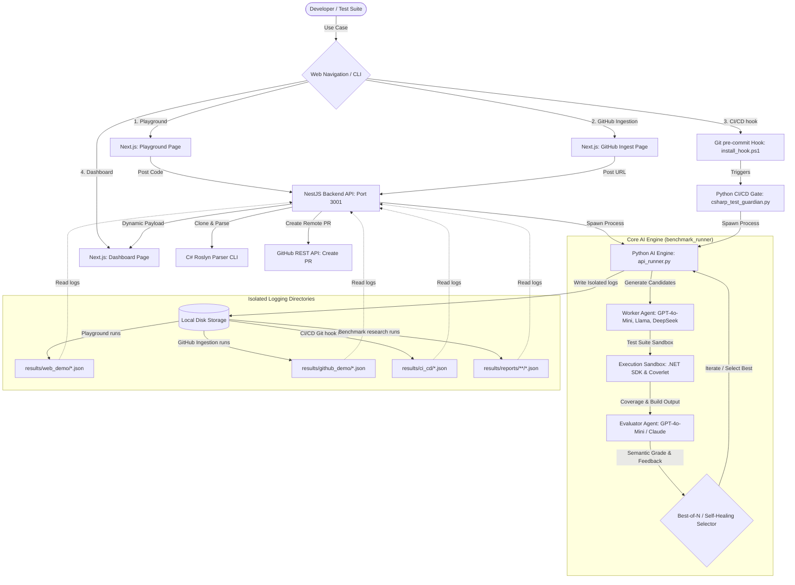

# C# AI Unit Test Generation & Optimization Framework

An advanced, empirical evaluation-based framework designed for benchmarking AI-generated C# unit tests using Large Language Models (LLMs). It features **Multi-Agent Review Critiques**, **Compiler-Feedback Self-Healing**, and **Best-of-N Candidate Selection** loops. 

This platform is developed to bridge academic research (suitable for Master's Independent Studies (IS) and academic conferences) with real-world developer workflows (featuring a Next.js/NestJS playground dashboard, C# Roslyn repository parsing, remote GitHub PR creation, and Git pre-commit gates).

---

## 🏗️ System Architecture

The following diagram illustrates the system architecture, showcasing the three primary execution pathways (Playground, GitHub Ingestion, and local Git hooks), their orchestration through the Python AI Engine, isolated logging directories, and downstream telemetry rendering in the Next.js Dashboard.



---

## 🌐 Web Application Features

The Next.js/NestJS web application is split into three main modules accessible via the navigation header:

1. **Playground**: A web IDE panel where developers can paste arbitrary C# source code, choose an AI model and orchestration workflow, run test generation, and view real-time results (generated tests, compilation logs, execution times, coverage reports, and agent evaluations).
2. **GitHub Ingest**: A remote repository ingest system that accepts any public GitHub URL. The backend clones the repository, runs the Roslyn Parser CLI to extract classes and methods, lists them in an interactive directory tree, and allows generating tests for any method. The output can be pushed back to the repository as a Pull Request automatically.
3. **Dashboard**: An analytical control panel summarizing performance metrics (such as unit test pass rates, line/branch coverage, execution times, API token costs, and LLM semantic grades) using custom SVG charts. It features three independent tabs segregating execution logs (Playground, GitHub, CI/CD) and a **Static Reports** tab offering in-depth comparative views (Overall Summary, Cost Efficiency with Worker vs. Evaluator cost breakdown, Evaluator Review, Candidate Selector, failure reasons, and compiler self-healing progress).

---

## 📂 Project Directory Structure

```text
├── ai-unit-test-benchmark/          # Core Benchmark Research Framework
│   ├── benchmark_runner/            # Python Orchestration Engine
│   │   ├── src/
│   │   │   ├── agents/              # Worker & Evaluator Agent classes & Prompts
│   │   │   ├── execution/           # .NET build, Coverlet parsing, and report writing
│   │   │   ├── summary/             # Report aggregation (Markdown, CSV, JSON)
│   │   │   └── config/              # Model registries and token pricing
│   │   │
│   │   ├── benchmark_datasets/      # Benchmark target suites (V1 & V2)
│   │   │   └── v2/                  # V2 Dataset including 211 C# method samples
│   │   │
│   │   ├── csharp_projects/         # .NET Sandbox Projects & Roslyn Parser
│   │   │   ├── BenchmarkSourceProject/   # Source code sandbox for research benchmarks
│   │   │   ├── BenchmarkTestProject/     # Test execution sandbox for research benchmarks
│   │   │   ├── DemoSourceProject/        # Source code sandbox for Playground & GitHub runs
│   │   │   ├── DemoTestProject/          # Test execution sandbox for Playground & GitHub runs
│   │   │   └── RoslynParserCli/          # Roslyn-based syntactic C# method extractor
│   │   │
│   │   ├── results/                 # Output folder generated dynamically on runs
│   │   │   ├── generated_tests/     # Final generated unit tests per model/workflow
│   │   │   ├── reports/             # Raw test execution analytics JSON (Benchmarks)
│   │   │   ├── web_demo/            # Isolated JSON logs for Web Playground runs
│   │   │   ├── github_demo/         # Isolated JSON logs for GitHub Ingestion runs
│   │   │   ├── ci_cd/               # Isolated JSON logs for pre-commit Git hook runs
│   │   │   └── summary/             # Markdown tables, CSVs, and JSON charts
│   │   │
│   │   ├── main.py                  # Main orchestrator runner for dataset benchmark runs
│   │   ├── api_runner.py            # Dynamic process runner called by NestJS Backend
│   │   ├── csharp_test_guardian.py  # Local Git pre-commit CI/CD gate script
│   │   ├── install_hook.ps1         # Installer script for Git pre-commit hook
│   │   └── .env                     # AI Models, Azure and GitHub Credentials
│   │
│   └── README.md                    # Core project documentation
│
└── ai-unit-test-app/                # Web Demo Playground Dashboard
    ├── backend/                     # NestJS API backend (Port 3001)
    │   └── src/
    │       ├── main.ts              # CORS & API Port configuration (3001)
    │       └── app.controller.ts    # API Endpoints (generate, github/clone, github/create-pr, dashboard logs)
    │
    └── frontend/                    # Next.js web application (Port 3000)
        └── src/
            └── app/
                ├── globals.css      # Premium glassmorphic styling & radial gauge
                ├── page.tsx         # Split-pane C# editor playground & GitHub ingestion UI
                └── dashboard/       # Dashboard routes
                    └── page.tsx     # Dynamic dashboard featuring SVG charts & logs
```

---

## ⚙️ Environment Configurations

Create a `.env` file under the `ai-unit-test-benchmark/benchmark_runner/` folder:

```env
AZURE_OPENAI_KEY=your-azure-key
AZURE_OPENAI_ENDPOINT=https://your-endpoint.services.ai.azure.com/openai/v1

# Worker Models (cheap / fast models)
AZURE_WORKER_GPT_MODEL=gpt-4.1-mini
AZURE_WORKER_LLAMA_MODEL=Llama-3.3-70B-Instruct
AZURE_WORKER_DEEPSEEK_V3_MODEL=DeepSeek-V3.2

# Evaluator Model (strong / reasoning models)
AZURE_EVALUTOR_GPT_MODEL=gpt-4.1

# GitHub Personal Access Token (for remote PR creation in GitHub Ingest)
GITHUB_PAT=your-github-personal-access-token

TIMEOUT_SECONDS=90
MAX_TOKENS=800
```

---

## 🛡️ Local Git Pre-Commit CI/CD Gate

The framework includes a local Git pre-commit hook that acts as a quality gate, preventing commits that introduce compiling errors or fail to meet target code coverage standards.

### How it works:
1. When you run `git commit`, the pre-commit hook triggers.
2. It detects staged C# files (excluding test files).
3. For each staged C# file, it calls the AI Engine to generate a unit test suite using the `self_healing` workflow with the `gptmini` model.
4. The generated unit tests are executed in the local sandbox:
   - If compilation or execution fails, the commit is **blocked**.
   - If line coverage is below the threshold (**80%**), the commit is **blocked**.
   - If the tests pass and coverage is met, the generated test file is saved next to the source code (e.g., `ClassFileTests.cs`), staged automatically, and the commit is allowed to proceed.
5. All execution details (metrics, compile status, cost, latency) are saved under `results/ci_cd/` as JSON logs.

### Installation:
From the `ai-unit-test-benchmark/benchmark_runner` directory, run the PowerShell installer:
```powershell
.\install_hook.ps1
```
*(This script links the hook script into your local `.git/hooks/pre-commit` directory.)*

### Manual Execution:
You can also run the guardian script manually on your current staged files:
```bash
py csharp_test_guardian.py
```

---

## 🌐 GitHub Pull Request Integration

The **GitHub Ingest** panel allows developers to automatically create Pull Requests for remote repositories with generated tests:
1. Enter a GitHub repository URL to clone it locally in the backend temporary folder.
2. The Roslyn Parser scans all source code and lists public methods.
3. Once a test is generated and validated, click **Create Pull Request**.
4. The NestJS backend uses the configured `GITHUB_PAT` to:
   - Authenticate and checkout a new branch `ai-unit-tests-{timestamp}`.
   - Commit the generated unit test file to the correct directory (e.g. `SourceFileTests.cs`).
   - Push the branch to the remote repository.
   - Open a Pull Request targeting `main` (or fall back to `master`) containing the generated tests and execution metadata.

---

## 🏃 Running the Benchmark Suites (CLI)

Run the benchmark runner from the `ai-unit-test-benchmark/benchmark_runner/` directory using your Python virtual environment.

> 💡 **Supported Models (`--model`):**
> * `gptmini` (Azure GPT-4.1-mini)
> * `llama` (Azure Llama-3.3-70B-Instruct)
> * `deepseekv3` (Azure DeepSeek-V3.2)

> **Note (Windows):** Use `py` instead of `python` to invoke the Python launcher. Add `2>&1 | Tee-Object <log-file>` to display output in the terminal **and** save it to a log file simultaneously.
>
> 🔄 **Resuming / Re-running failed cases:** You can append `--skip-existing` to the command to skip benchmarks that already have report JSON files generated under `results/reports/`. This allows you to resume interrupted runs or fix/re-run specific failed cases (simply by deleting their matching `.json` report file before running):
> ```bash
> py main.py --version v2 --model gptmini --workflow agent --skip-existing
> ```
>
> 🧬 **Mutation Testing:** You can append `--enable-mutation` to the command (e.g., `main.py`) to run Stryker.NET mutation testing on successful compilation runs. For `api_runner.py` (spawned by the web backend), mutation testing runs by default but can be bypassed with `--no-mutation`.

### 1. Single-Pass Generation
Generates the unit test once, builds/runs it, computes coverage, and evaluates it.
```bash
py main.py --version v2 --model gptmini --workflow single
```

### 2. Multi-Agent Critique & Refinement
Invokes a critique phase where a Reviewer Agent reviews the test and a Worker Agent refines it before sandbox compilation.
```bash
py main.py --version v2 --model gptmini --workflow agent
```

### 3. Self-Healing (Compiler-Feedback)
Attempts to iteratively resolve C# build or runtime test failures based on compiler error codes (`CSxxxx`) up to 3 times.
```bash
py main.py --version v2 --model gptmini --workflow self_healing
```

### 4. Best-of-N Candidate Selection
Generates $N=3$ candidate variations with temperature = 0.5, runs them in the sandbox, obtains coverage and semantic grades from the Evaluator Agent, and saves only the candidate with the highest overall evaluator score.
```bash
py main.py --version v2 --model gptmini --workflow best_of_n
```

### 5. Evaluator-Guided Iterative Refinement
Generates a unit test and evaluates it. If the Evaluator Agent's score is below 75, the generator receives the evaluator's specific critique and suggestions to refine the test, repeating up to 3 times or until the score threshold is met.
```bash
py main.py --version v2 --model gptmini --workflow evaluator_guided
```

### 6. Ultimate Hybrid (Proposed Framework)
Integrates Best-of-N Candidate Generation ($N=3$, temperature = 0.5), compiler-feedback Self-Healing on failed candidates, Best Candidate selection, and Evaluator-Guided Iterative Refinement.
- **Best-of-N Candidate Generation**: Generates $N=3$ independent unit test candidates concurrently at a higher temperature ($T=0.5$) to encourage exploratory test design.
- **Compiler-Feedback Self-Healing**: Checks all $N$ candidates in the .NET test sandbox. Any candidate that fails to compile or run undergoes up to 3 rounds of automated healing, using Roslyn and .NET compiler errors to resolve issues.
- **Best Candidate Selection**: Evaluates all successful or partially-healed candidates against coverage metrics (Line/Branch) and semantic grading. The candidate with the highest overall score is selected.
- **Evaluator-Guided Iterative Refinement**: Takes the selected best candidate, reads specific feedback/critiques from the Evaluator Agent, and performs up to 3 rounds of refinement to maximize coverage and cover complex edge cases.

```bash
py main.py --version v2 --model gptmini --workflow ultimate_hybrid
```
With real-time log capture:
```bash
py main.py --version v2 --model gptmini --workflow ultimate_hybrid 2>&1 | Tee-Object results/logs/run_log_v2_gptmini_ultimate_hybrid.txt
```

### 7. Generate Analytical Summaries
Aggregate all execution reports, latency metrics, monetary costs, evaluator-guided improvements, and compile error logs across categories:
```bash
py src/summary/main.py
```
Output results are exported under `results/summary/{version}/` in Markdown, CSV, and JSON formats.

---

## 🛠️ Dataset Engine Pipeline

The `dataset_engine` is a built-in utility pipeline designed to ingest raw C# methods and matching human tests, validate their structure/metadata, autofill complexity metrics, and build version-controlled benchmark datasets.

### 1. Ingesting from Local Cloned GitHub Repos
Iterates through configured repositories under `repositories/`, extracts public methods via regex, matches them with corresponding unit tests, and exports raw pairs under `raw_datasets/real_world`:
```bash
py src/dataset_engine/main.py import
```

### 2. Building Dataset Version
Validates the raw datasets, validates/migrates metadata, autofills cyclomatic complexity and code checks, compiles error reports (`failed_samples.json` and `warnings.json`), generates a central index manifest file, and copies the valid benchmarks into a new version (e.g. `benchmark_datasets/v3/`):
```bash
py src/dataset_engine/main.py build
```

---

## 💻 Running the Web Playground Application

Allows users to paste C# methods dynamically, select models/workflows, and view test generation results.

### Prerequisite
Ensure the Python virtual environment under `ai-unit-test-benchmark/.venv` has its dependencies installed.

### 1. Start the NestJS Backend API
From the `ai-unit-test-app/backend` directory:
```bash
npm run start
```
Server runs on [http://localhost:3005](http://localhost:3005).

### 2. Start the Next.js Frontend Dashboard
From the `ai-unit-test-app/frontend` directory:
```bash
npm run dev
```
Open [http://localhost:3001](http://localhost:3001) in your web browser.

---

## 🔍 Running the C# Roslyn Parser CLI

To parse any C# file and extract public method details into a structured JSON payload:

From the `ai-unit-test-benchmark/benchmark_runner` directory:
```bash
dotnet run --project csharp_projects/RoslynParserCli -- <input-csharp-file-path> [output-json-path]
```

### Example Input (`SourceCode.cs`):
```csharp
public class Calculator {
    public int Add(int a, int b) {
        return a + b;
    }
}
```

### Example JSON Output:
```json
[
  {
    "ClassName": "Calculator",
    "MethodName": "Add",
    "ReturnType": "int",
    "Modifiers": [ "public" ],
    "Parameters": [
      { "Name": "a", "Type": "int" },
      { "Name": "b", "Type": "int" }
    ],
    "Body": "public int Add(int a, int b)\r\n    {\r\n        return a + b;\r\n    }"
  }
]
```

---

## 📊 Evaluation Metrics Details

The framework evaluates AI generated tests using 7 key criteria, now with deep granular logging enabled across all workflows:
1. **Compilation Success Rate**: Percentage of tests that compile successfully.
2. **Test Pass Rate**: Percentage of test assertions that succeed under the xUnit runner.
3. **Line & Branch Coverage**: Code coverage computed dynamically using `Coverlet` (Cobertura reports).
4. **Assertion Quality**: Graded by the Evaluator Agent (0-100 score) assessing edge cases, mock structure, and assertion depth.
5. **Execution Latency Breakdown**:
   * **Worker Latency (`worker_latency`)**: Total time spent executing Worker LLM calls (generation/healing).
   * **Evaluator Latency (`evaluator_latency`)**: Total time spent executing Evaluator Agent grading.
   * **Total Latency (`latency`)**: Sum of worker and evaluator latencies.
6. **Token API Cost Breakdown**:
   * **Worker Cost (`worker_cost`, `worker_prompt_tokens`, `worker_completion_tokens`)**: Computational footprints and cost of the worker model.
   * **Evaluator Cost (`evaluator_cost`, `evaluator_prompt_tokens`, `evaluator_completion_tokens`)**: Footprints and cost of the evaluator agent.
   * **Total Cost (`cost`, `prompt_tokens`, `completion_tokens`)**: Consolidated costs and token usage.
7. **Mutation Score**: Evaluates the strength and fault-detection capabilities of the unit test suite by injecting synthetic faults (mutations) using Stryker.NET. Computes the percentage of mutants successfully killed by the tests (`mutation_score`, `total_mutants`, `killed_mutants`, `survived_mutants`, `ignored_mutants`, `timeout_mutants`).

### 🔄 Initial State & Iteration Logging
To support advanced telemetry, the framework tracks:
* **Initial State Metrics (`initial_line_coverage`, `initial_branch_coverage`, `initial_evaluator_score`, `initial_success`)**: The metrics of the very first generated candidate before entering any self-healing or evaluator-guided refinement loops.
* **Per-Attempt Loop Logs**: Every attempt in `healing_log`, `evaluator_loop_log`, and candidate in `best_of_n_candidates` includes iteration-specific token usage, cost, and latency.

---

## 🎓 Graduate Research Project Information

This platform is developed as part of a Master of Engineering (M.Eng.) thesis project at Dhurakij Pundit University.

| Detail | Description |
| :--- | :--- |
| **Research Topic** | A Multi-Agent LLM-Based Approach for Automated Unit Test Generation and Optimization in C# Programs <br> *(แนวทางแบบ Multi-Agent ร่วมกับ Large Language Models สำหรับการสร้างและปรับปรุง Unit Test อัตโนมัติในโปรแกรมภาษา C#)* |
| **Researcher** | **Mr. Attaphon Pungjaree** (Student ID: 645162020028) |
| **Thesis Advisor** | **Dr. Thanaphat Khankajit** |
| **Degree** | Master of Engineering (M.Eng.) |
| **Major** | Artificial Intelligence and Data Engineering |
| **College** | College of Engineering and Technology |
| **University** | **Dhurakij Pundit University** (110/1-4 Prachachuen Road Laksi, Bangkok, 10210) |
| **Contact** | ✉️ Email: [645162020028@dpu.ac.th](mailto:645162020028@dpu.ac.th) <br> 📞 Phone: 095-792-5262 |
